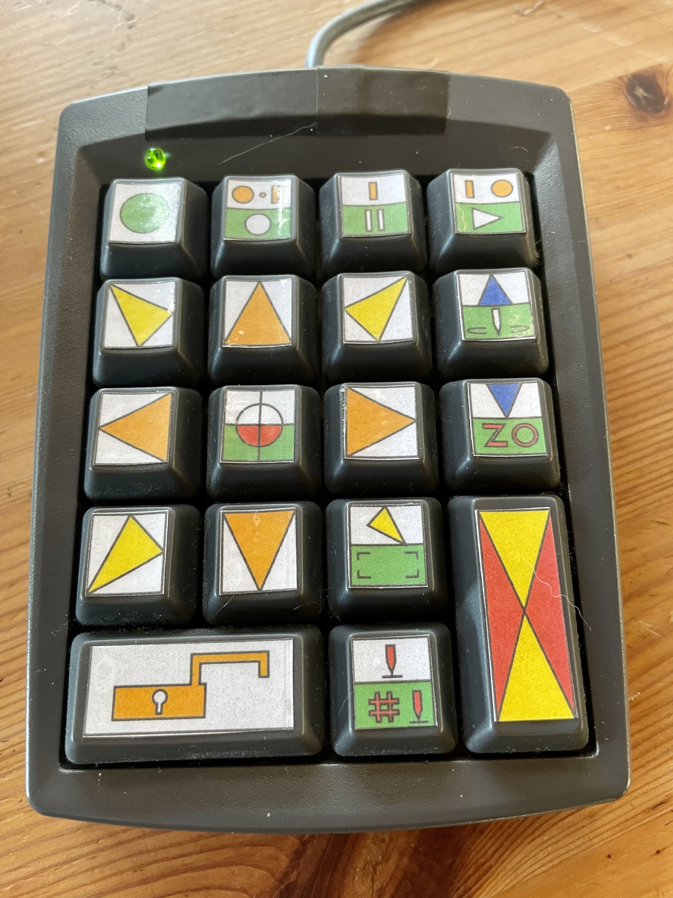
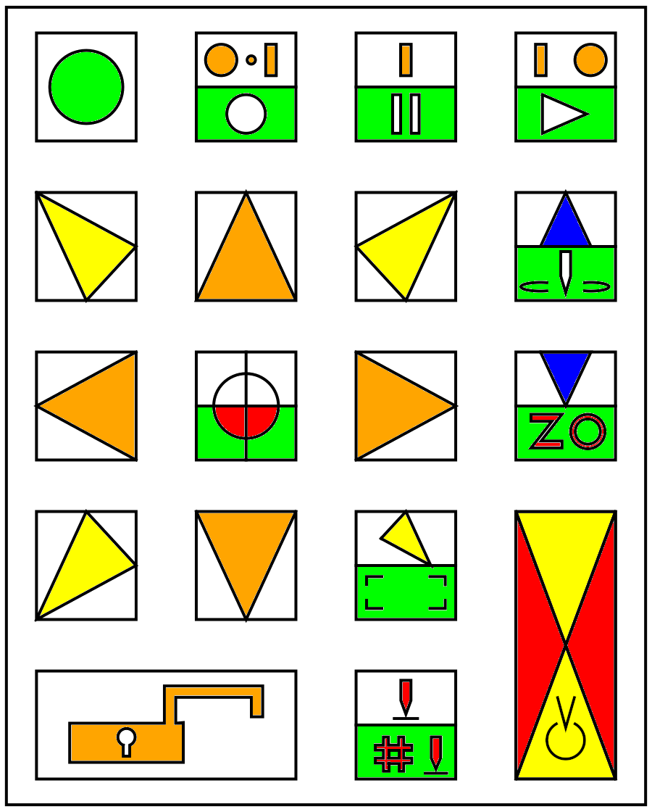

# cncjs-pendant-numpad
A fork of https://github.com/mariolukas/cncjs-pendant-numpad using a Genovation Micropad 631.

 

--

Built for a Genovation 631 on a Raspberry Pi 3b+ running Arch ARM.  See parent project for installation and other details.

#### Mods for this fork

Numlock key functions as a "layer switch".  Also multi-taps can be coded as another "layer."  Currently this is only used for shutting the system down.  Tapping the RESET key 5x within a time window runs ~/shutdown.

There is a key to run the cncjs-kt-ext macro.  Running the macro here was a bit of a challenge, per https://github.com/cncjs/cncjs/issues/398 .  There is also a key to trace the outline of the loaded gcode.  Both the macro runner and the outline tracer use code from https://github.com/cncjs/cncjs-shopfloor-tablet .

The docs folder of this repo has key labels as Freecad sketch, the SVG export of this, and finally a colored PNG.

Here are the current coded key assigments.

```
[01] [02] [03] [04]

[05] [06] [07] [08]

[09] [10] [11] [12]

[13] [14] [15] [16]
               [  ]
[17   18] [19] [20]
```
- 01:
  - layer swap.  lights green LED (Numlock), enables second/lower/green function on some keys.  keys without green functions function on both layers.  this first button does nothing on its own (cannot!), it simply toggles numlock... errr... "the green layer"
- 02:
  - set movement to 0.1mm
  - green: stop running GCode. after stopping, also stop the spindle, wait a second, and move to safe Z (10).
- 03:
  - set movement to 1.0mm
  - green: pause or resume GCode, depending on current state
- 04:
  - set movement to 10mm
  - green: start ("play") loaded GCode
- 05:
  - move back and left, X-- Y++
- 06:
  - move back, Y++
- 07:
  - move back and right, X++ Y++
- 08:
  - move up, Z++
  - green: toggle spindle (at full speed)
- 09:
  - move left, X--
- 10:
  - move XY to local coordinate zero
  - green: zero out XY local coordinates at current position
- 11:
  - move right, X++
- 12:
  - move down, Z--
  - green: zero out Z local at current position
- 13:
  -  move forward and left, X-- Y--
- 14:
  - move forward, Y--
- 15:
  - move foward and right, X++ Y--
  - green: run gcode to traverse the outline of current GCode at safe Z (10)
- 16-20:
  - panic! stop all movement! (executes gcode RESET)
  - press 5x for system shutdown (via a ~/shutdown script)
- 17-18
  - unlock
- 19
  - execute z-probe with zero offset (z-probe offsets are zero because we are PCB-centric)
  - green: run and apply z-probe grid on current GCode, zero offset
